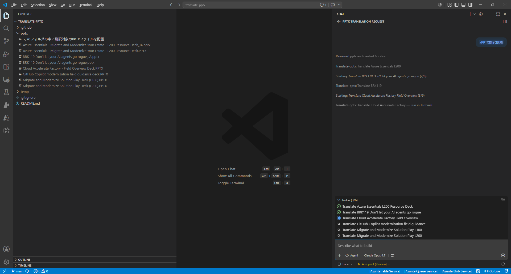

# translate-pptx

PPTX ファイル（PowerPoint プレゼンテーション）を **英語 ⇄ 日本語** で双方向に翻訳する GitHub Copilot エージェント。元のレイアウト・書式・画像・図形・色をそのまま保ち、翻訳後の表示で違和感が出ないよう各方向に合わせたフォント整形まで自動で行う:

- **en2ja（既定）**: 英語 PPTX → 日本語 PPTX。`_JA` サフィックス。東アジアフォントを **Yu Gothic UI** に統一
- **ja2en**: 日本語 PPTX → 英語 PPTX。`_EN` サフィックス。東アジアフォントを除去し、ラテンフォントを **Segoe UI / Segoe UI Semibold** に統一（見出しが PowerPoint 既定の Calibri Light にフォールバックすることを防止）

## 前提条件

- 対応 OS: **Windows / PowerShell**、**Linux**、**macOS**、**WSL2** （いずれも検証済み）
- Python 3.10 以上
- VS Code + GitHub Copilot
- 推奨モデル: `Claude Opus 4.7`

## セットアップ

依存パッケージをインストール:

```bash
pip install -r requirements.txt
```

> 必要なパッケージは `defusedxml` のみです。

## 使い方

1. 翻訳対象 PPTX を [pptx/](pptx/) フォルダに配置
2. GitHub Copilot の Agent モード `Autopilot` で `/PPTX翻訳依頼` プロンプトを起動

```text
/PPTX翻訳依頼
```

## 動作イメージ

`pptx/` 配下の対象ファイルを列挙し、1 ファイルずつ順番にエージェント翻訳を実行。翻訳が完了すると逐次 `pptx/<元ファイル名>_JA.pptx`（または `_EN.pptx`）が生成され、最後に出力ファイル一覧が報告される



## 特長

- **双方向翻訳**: en2ja（英→日）と ja2en（日→英）を同一エージェントで実行
- **レイアウト保持**: スライドの配置、書式、画像、図形、文字色は変更しない
- **本文 + ノート翻訳**: スライド本文 (`ppt/slides/`) に加え、発表者ノート (`ppt/notesSlides/`) も翻訳
- **方向別フォント整形**:
  - en2ja: slides / notesSlides / slideLayouts / slideMasters / notesMasters / theme の全 XML で東アジアフォント (`<a:ea>`) を **Yu Gothic UI** に統一
  - ja2en: 上記すべてから `<a:ea>` を除去し、ラテンフォント (`<a:latin>`) と theme `<a:majorFont>` / `<a:minorFont>` を **Segoe UI / Segoe UI Semibold** に書き換え。太字 (`b="1"`) や見出しは Semibold、本文は Regular に振り分け
- **常用漢字の厳守（en2ja のみ）**: 文化庁告示の常用漢字表（2,136 字）のみを使用
- **中国語字形の混入防止（en2ja のみ）**: 簡体字・繁体字を排除し、日本語の正字を使用
- **ロケール更新**: en2ja は `lang="en-*"` → `lang="ja-JP"`、ja2en は `lang="ja-*"` → `lang="en-US"`
- **シャード分割翻訳辞書**: 翻訳辞書を `temp/translations/chunk_NNN.json` に分割し、LLM の出力トークン上限による途中切れを回避
- **二重翻訳ガード**: en2ja は `_JA` / `_EN` サフィックス入力を、ja2en は `_EN` サフィックス入力を拒否（`_JA` 入力は ja2en の正規入力として許可）
- **シリアル実行**: ファイル間は並列処理せず、1 ファイルずつ確実に処理

## 主要フォルダ構成

```
translate-pptx/
├── .github/
│   ├── agents/
│   │   ├── translate-pptx.agent.md           # エージェント定義（翻訳手順・ルール）
│   │   └── scripts/
│   │       ├── 1_unpack_pptx.py              # PPTX を展開
│   │       ├── 2_extract_texts.py            # ユニーク原文を抽出（正規化済み）
│   │       ├── 3_apply_translations.py       # 翻訳適用
│   │       ├── 4_pack_pptx.py                # 展開フォルダを PPTX に再パック
│   │       └── lib/
│   │           ├── __init__.py
│   │           └── _text_normalize.py        # 共通の文字正規化処理
│   └── prompts/
│       └── PPTX翻訳依頼.prompt.md             # エージェント起動プロンプト
├── pptx/                                     # 翻訳対象 PPTX を配置（ここに翻訳結果も出力）
└── README.md
```

## 翻訳ルール

詳細は [.github/agents/translate-pptx.agent.md](.github/agents/translate-pptx.agent.md) を参照

### 漢字の選択

- 常用漢字表（2,136 字）に含まれない漢字はひらがなで表記
- 補助動詞（「ください」「いたします」など）はひらがな
- 中国語字形（簡体字・繁体字）禁止 — `机` / `认证` / `应用` ではなく日本語正字 `機` / `認証` / `応用`

### 表記の統一

| 項目 | ルール | 例 |
|------|--------|-----|
| カタカナ語の長音 | 長音符号「ー」を付ける | サーバー、ユーザー、メモリー |
| 英数字 | 半角 | API、100、v2 |
| 括弧・句読点 | 全角 | （注意）、「定義」、、。 |
| 日本語と英数字の間 | 半角スペース | Azure の API |

### 技術用語の訳語統一（抜粋）

| 英語 | 日本語 |
|------|--------|
| Authentication | 認証 |
| Authorization | 認可（「承認」ではない） |
| Deploy / Deployment | デプロイ / デプロイメント（「展開」ではない） |
| Governance | ガバナンス |
| Observability | オブザーバビリティ |
| Credential | 資格情報 |
| On-premises | オンプレミス |
| Rate limiting | レート制限 |
| Load balancing | 負荷分散 |

### 翻訳対象外

以下は翻訳せず原文のまま保持:

- 製品名・サービス名（Azure、Microsoft Foundry、MCP、A2A など）
- 人名・会社名
- URL、メールアドレス
- 技術略語（REST、GraphQL、gRPC、RBAC、SDK など）

## 制約事項

- スライドのレイアウト・書式・画像・図形・文字色は変更しない
- XML の構造（タグ、属性、名前空間）は維持
- 翻訳対象は `<a:t>` タグ内のテキストのみ（本文 + ノート）
- en2ja: `<a:latin>` / `<a:cs>` は変更しない（英数字部分の見た目を保持）
- en2ja: `<a:ea>` 挿入は OOXML スキーマ順序を厳守（誤ると `<a:solidFill>` が無視され文字が白色化する不具合あり）
- ja2en: `<a:ea>` を全 XML から除去し、`<a:latin>` を Segoe UI 系で明示指定（theme 含む）。見出し相当（`b="1"` または既存 typeface に "Bold"/"Semibold"/"Black"/"Heavy" を含む）は Segoe UI Semibold、本文は Segoe UI に振り分け
- 元ファイルは上書きせず、`_JA` / `_EN` サフィックスを付けた新規ファイルとして保存
- 作業用中間ファイルはすべて `temp/` 配下で扱い、終了時に削除